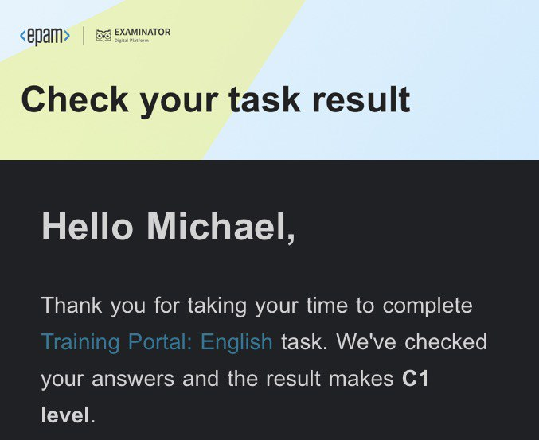

 

  

 
<h1>
  Mike || Matthew
</h1>

### About Me :

Hi there! I've been working as a frontend developer since 2019. Over the past few years, I've had the pleasure of working on a wide variety of projects, ranging from simple landing pages to complex web applications.

My main focus is on creating beautiful and user-friendly interfaces that help to enhance the overall user experience. I have a strong passion for creating responsive designs that look great on all devices, whether it's a desktop computer, a tablet, or a smartphone.

Aside from my technical skills, I'm also a strong believer in the importance of teamwork and collaboration. I'm always eager to work with other developers, designers, and stakeholders to help bring their ideas to life. I pride myself on my strong communication skills, which help me to work effectively with team members and ensure that everyone is on the same page.

### :hammer_and_wrench: Hard Skills :

  &nbsp;
  &nbsp;
  &nbsp;
  &nbsp;
  &nbsp;
  

                    

### Language Skills : 
- Chinese [HSK1]
- Georgian [Beginner]
- Russian [Native]
- English [C1/C2]
 

